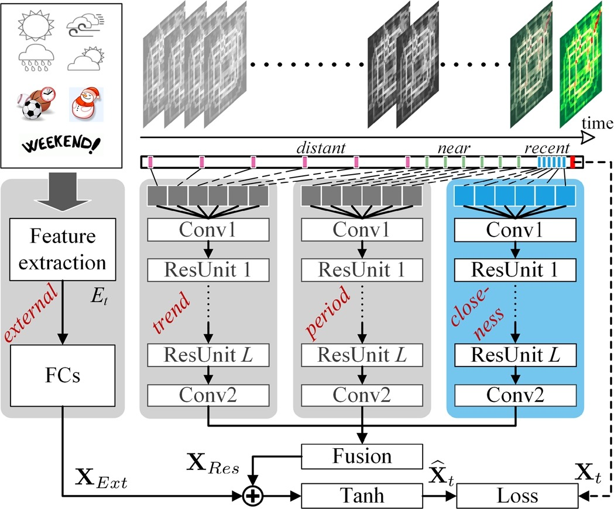

# ST-ResNet
ST-ResNet ([Deep Spatio-Temporal Residual Networks for Citywide Crowd Flows Prediction](https://arxiv.org/abs/1610.00081)) implementaion with Pytorch, improved preprocessing speed over the original code.




## Acknowledgement
Most of the code in the model definition isbased on [https://github.com/KL4805/STResNet-PyTorch](https://github.com/KL4805/STResNet-PyTorch), which is another ST-ResNet Pytorch implimentaion.


## Data
Copy *TaxiBJ* dataset under `TaxiBJ` dir.

> **Note**
> TaxiBJ dataset is currently unavailable due to circumstances at the data provider.
>
> See: [TaxiBJ21: An open crowd flow dataset based on Beijing taxi GPS trajectories](https://doi.org/10.1002/itl2.297)


## Example
```sh
python examples/run.py
```

## Reference
J. Zhang, Y. Zheng and D. Qi, "Deep spatio-temporal residual networks for citywide crowd flows prediction", AAAI, pp. 1655-1661, 2017.
